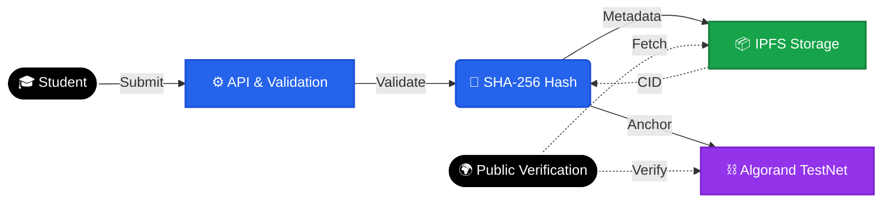

# 🔗 SkillChain
### AI-Powered Blockchain Credential System on Algorand TestNet

> **Turning skills into verifiable digital assets.**

---

## 🚨 Problem

Campus certification and skill validation systems suffer from:

- ❌ **Centralized trust dependency**
- ❌ **Easily forgeable certificates**
- ❌ **No cryptographic proof**
- ❌ **Slow, manual employer verification**
- ❌ **Lack of auditability**

In skills-based hiring, **trust is the bottleneck**.

Traditional systems rely on authority.  
**SkillChain replaces authority with cryptographic proof.**

---

## 💡 Solution

SkillChain is a blockchain-backed credential platform that anchors verified skill records on **Algorand TestNet**.

### How It Works

1. 🎓 **Student** submits skill proof (GitHub project)
2. 🛡 **Admin** validates submission
3. 🔐 **Credential metadata** is generated
4. 🧮 **SHA-256 hash** of metadata is created
5. 📦 **Certificate JSON** stored on **IPFS** (decentralized storage)
6. ⛓ **Hash anchored** on **Algorand TestNet**
7. 🔎 **Public verification** compares hash integrity

> **If metadata is altered → hash mismatch → credential invalid.**  
> **No trust required. Only math.**

---

## ⛓ Why Algorand

SkillChain uses **Algorand TestNet** as its immutable trust layer because:

- ⚡ **Instant finality** (no rollback risk)
- 💰 **Extremely low transaction fees**
- 🌱 **Energy-efficient Pure Proof-of-Stake**
- 🧾 **Designed for digital assets & identity systems**
- 🔐 **Secure and scalable for institutional adoption**

**Algorand acts as the single source of truth for credential integrity.**

---

## 🏗 High-Level Architecture

**Student** → **API** → **Validation** → **SHA-256 Hash**  
↓  
**IPFS** (Decentralized Storage)  
↓  
**Algorand TestNet** (Immutable Anchor)  
↓  
**Public Verification Portal**

Off-chain for scalability. On-chain for immutability. **Zero-trust verification model.**

---

## 🛠 Technology Stack

### **Frontend**
- **React + Vite**
- **Tailwind CSS**

### **Backend**
- **Node.js + TypeScript**
- **Express REST API**
- Role-based access control

### **Data & Storage**
- **MongoDB** (metadata indexing)
- **IPFS via Pinata** (decentralized certificate storage)

### **Blockchain**
- **Algorand TestNet**
- SHA-256 cryptographic hashing
- On-chain hash anchoring

### **Infrastructure**
- Dockerized environment
- Jest test suite

---

## ✨ Key Features

- 🔐 **Tamper-proof credential validation**
- 🌍 **Public verification endpoint**
- 🧮 **Deterministic hash integrity layer**
- 👥 **Role-based workflows** (Student / Admin / Employer)
- 📦 **Decentralized metadata storage**
- ⛓ **Blockchain-backed trust model**

---

## 🌍 Impact

SkillChain enables:

- **Fraud-resistant certification**
- **Instant recruiter validation**
- **Transparent audit trail**
- **Reduced institutional dependency**
- **Scalable campus credential systems**

Built for:
🎓 **Universities** | 🏫 **Campus platforms** | 💼 **Recruiters** | 🌐 **Skills-based ecosystems**

---

## 🚀 Verification Example

**Public verification endpoint:**
`GET /api/verify/:credentialId`

**Returns:**
- `valid` → Credential existence
- `hashMatch` → Integrity status
- `certificateHash`
- `ipfsCid`
- `Blockchain transaction reference`

> Any mismatch automatically invalidates the credential.

---

## 🔮 Future Scope

- [ ] Smart contract automation on Algorand
- [ ] Wallet-based ownership
- [ ] On-chain SBT minting
- [ ] AI-powered skill validation
- [ ] Cross-campus credential portability

---

## 🧠 Vision

We believe credentials should be:
**Immutable • Publicly verifiable • Cryptographically secured • Independent of centralized trust**

SkillChain transforms skills into **mathematically provable digital assets.**

---

## 🏷 Team

**ChainAI Labs**
