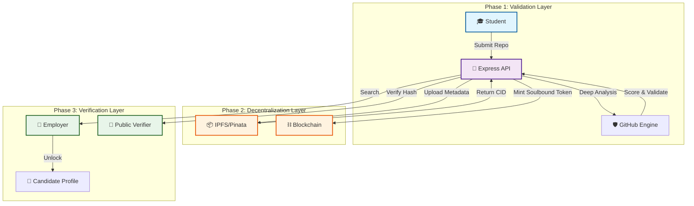

# 🔗 SkillChain

<p align="center">
  
</p>

<p align="center">
  <a href="#-core-features">Features</a> •
  <a href="#-system-architecture">Architecture</a> •
  <a href="#-technology-stack">Tech Stack</a> •
  <a href="#-getting-started">Getting Started</a> •
  <a href="#-api-documentation">API</a>
</p>

---

> **🏆 Hackathon Submission: Decentralized, Verified, and Unstoppable Micro-Credentials.**

**SkillChain** bridges the gap between **Web2 development** and **Web3 identity**. We transform verifiable GitHub contributions into **Soulbound Tokens (SBTs)**, creating an immutable, tamper-proof resume that developers own forever.

---

## 💡 The Problem
In the current hiring landscape:
*   **Resume Fraud**: 55% of resumes contain exaggerations or lies.
*   **Platform Lock-in**: Your reputation is stuck on LinkedIn or Upwork.
*   **Verification Costs**: Employers spend billions annually on background checks.

## 🚀 The Solution: SkillChain
We built a trustless verification engine that:
1.  **Analyzes** code directly from the source (GitHub).
2.  **Mints** a permanent proof of skill as a Soulbound Token (SBT) on the blockchain.
3.  **Stores** metadata on IPFS for decentralized, censorship-resistant access.

---

## 🏗 System Architecture

The SkillChain ecosystem coordinates automated analysis, decentralized storage, and blockchain finality to ensure credential integrity.



---

## 🔥 Technical Highlights (Why this wins)

### 1. Cryptographic Integrity
We don't just store data; we seal it. Every credential includes a **SHA-256 hash** of its metadata.
- **Tamper-Proof**: If the IPFS data changes, the hash on-chain won't match.
- **Trustless**: Verifiers don't need to trust us, just the math.

### 2. Hybrid Web3 Architecture
We solve the "Blockchain Bloat" problem by using **IPFS for data** and **Blockchain for proofs**.
- **Cost**: Gas fees are minimized by storing only the `CID` and `Hash` on-chain.
- **Speed**: Metadata retrieval is instant via IPFS gateways.

### 3. Automated Quality Gate
Our GitHub Engine doesn't just check for existence. It analyzes:
- **Repo Age & Activity**: Prevents "day-old" fake repos.
- **Language Detection**: Ensures the code matches the claimed skill.
- **Contribution History**: Verifies active ownership.

---

## 🛠 Technology Stack

| Component | Tech | Role |
| :--- | :--- | :--- |
| **Backend** |   | Core Business Logic & API |
| **Database** |  | User Data & Off-chain Indexing |
| **Blockchain** |   | Smart Contract Interaction |
| **Storage** |   | Decentralized Metadata Storage |
| **Infrastructure** |   | Containerization & Testing |

---

## 🚀 Getting Started

### Prerequisites
- Node.js v18+
- MongoDB (Running locally or Atlas)
- Pinata Account (for IPFS)

### Installation

```bash
# 1. Clone the repo
git clone https://github.com/rushikesh249/skillchain.git
cd skillchain

# 2. Install dependencies
npm install

# 3. Configure Environment
cp .env.example .env
# Fill in your MONGODB_URI and PINATA keys

# 4. Initialize Database
npm run seed

# 5. Start Development Server
npm run dev
```

---

## 📖 API Documentation

The platform features a fully documented REST API. Access Swagger UI at `http://localhost:3000/api-docs`.

| Endpoint | Functionality |
| :--- | :--- |
| **POST** `/api/auth/register` | User Registration (Student/Employer) |
| **POST** `/api/submissions` | Submit GitHub Repo for Analysis |
| **GET** `/api/verify/:id` | Verify Credential Validity |
| **POST** `/api/admin/approve` | Mint SBT (Admin Only) |

---

## 🔮 Future Roadmap

- [ ] **Multi-Chain Support**: Expand to Polygon and Solana for lower gas fees.
- [ ] **AI Code Review**: Integrate LLMs to analyze code quality, not just metadata.
- [ ] **Zero-Knowledge Proofs (ZK)**: Allow students to prove skills without revealing their identity.

---

## 🤝 Contributing & License

SkillChain is built with ❤️ for the developer community. Distributed under the **MIT License**.

