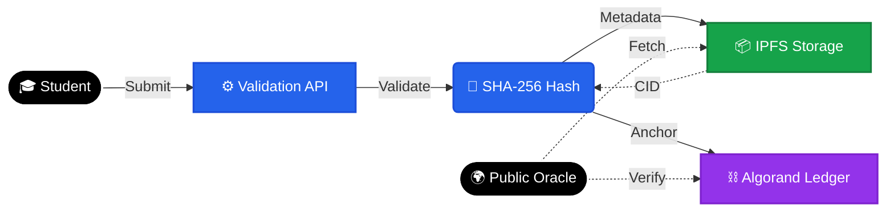

# 🔗 SkillChain
### AI-Powered Blockchain Credential System on Algorand

> **Turning verified skills into immutable, publicly verifiable digital assets.**

---

## 🚨 The Problem

Campus and skill certification systems today:

- ❌ **Rely on centralized trust**
- ❌ **Allow modification or deletion of records**
- ❌ **Provide no cryptographic proof**
- ❌ **Require manual employer verification**
- ❌ **Lack transparency and auditability**

In skills-based hiring, **trust is the bottleneck.**

---

## 💡 Our Solution

SkillChain is a blockchain-backed credential platform that:

- ✅ **Validates skill submissions**
- ✅ **Generates certificate metadata**
- ✅ **Stores certificate JSON on IPFS**
- ✅ **Anchors cryptographic hash on Algorand TestNet**
- ✅ **Enables public, trustless verification**

> **If any certificate data changes → Hash mismatch → Credential invalid.**  
> **Verification does not depend on authority. It depends on mathematics.**

---

## ⛓ Blockchain Layer (Algorand Integration)

SkillChain uses **Algorand TestNet** as an immutable trust layer.

### What We Implemented
- 🧮 **SHA-256 deterministic hashing** of certificate metadata
- 🔗 **Hash anchoring workflow** to blockchain layer
- 🧾 **Immutable transaction reference** stored with credential
- 🔍 **Public verification endpoint** validating integrity
- 🚫 **Tamper detection logic** (recalculate & compare hash)

**Algorand ensures:**
- ⚡ **Instant finality**
- 💰 **Low transaction cost**
- 🌱 **Energy-efficient validation**
- 🌍 **Public verifiability**

---

## 🏗 Architecture Overview

**Student** → **Validation API** → **SHA-256 Hash**  
↓  
**IPFS** (Decentralized Storage)  
↓  
**Algorand Blockchain** (Immutable Anchor)  
↓  
**Public Verification Portal**

Off-chain for scalability. On-chain for immutability. **Zero-trust verification model.**

---

## 🛠 Tech Stack

### **Frontend**
- **React + Vite**
- **Tailwind CSS**

### **Backend**
- **Node.js + TypeScript**
- **Express REST APIs**
- Role-based authentication

### **Storage & Data**
- **MongoDB** (metadata indexing)
- **IPFS via Pinata** (certificate storage)

### **Blockchain**
- **Algorand TestNet**
- SHA-256 cryptographic hashing
- Immutable hash anchoring

### **Infrastructure**
- Dockerized setup
- Jest automated test suite
- Modular service architecture

---

## ✅ What Is Fully Implemented

- [x] Student submission workflow
- [x] Admin approval pipeline
- [x] Certificate JSON generation
- [x] IPFS storage integration
- [x] Deterministic SHA-256 hashing
- [x] Integrity verification logic
- [x] Public verification endpoint
- [x] Role-based system (Student / Admin / Employer)
- [x] Tamper detection system
- [x] Clean API documentation

---

## 🚧 What Is In Progress / Future Scope

- [ ] Smart contract automation layer on Algorand
- [ ] Direct wallet-based credential ownership
- [ ] Full on-chain NFT/SBT minting
- [ ] AI-based automated skill scoring
- [ ] Cross-campus credential portability

---

## 📂 Key Files Judges May Review

To understand the core blockchain logic, please see:

- `src/services/blockchain/` → **Hashing & anchoring logic**
- `src/modules/verify/verify.service.ts` → **Integrity validation**
- `src/modules/admin/admin.service.ts` → **Credential issuance pipeline**
- `src/services/ipfs/` → **Decentralized storage integration**
- `tests/integrity.test.ts` → **Deterministic hash verification tests**

> **These files demonstrate:**  
> Cryptographic integrity logic • Blockchain anchoring flow • Tamper-proof validation design

---

## 🔎 Public Verification Example

**GET** `/api/verify/:credentialId`

**Returns:**
- `valid`
- `hashMatch`
- `certificateHash`
- `ipfsCid`
- `blockchain reference`

> **Any mismatch automatically invalidates the credential.**

---

## 🌍 Impact

SkillChain enables:
- **Fraud-resistant digital credentials**
- **Instant recruiter verification**
- **Transparent audit trails**
- **Scalable campus blockchain infrastructure**
- **Trustless credential validation**

---

## 🧠 Vision

We believe credentials should be:
**Immutable • Publicly verifiable • Cryptographically secured • Independent of centralized trust**

SkillChain transforms skills into **verifiable digital assets.**

---

## 👥 Team

**ChainAI Labs**
