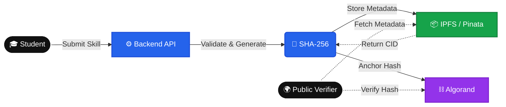

# SkillChain

**Blockchain-backed credential platform for tamper-proof skill verification.**

SkillChain transforms skill submissions into cryptographically signed, publicly verifiable credentials — anchored on the **Algorand blockchain**. No central authority. No trust required. Just math.

---

## What It Does

Students submit skill proof (GitHub projects). Admins validate. A **SHA-256 hash** of the credential is anchored on **Algorand**, and metadata is stored on **IPFS**. Anyone can verify a credential's integrity instantly via a public endpoint — without contacting the issuing institution.

> **If the credential is tampered with → hash mismatch → instantly invalidated.**

---

## Architecture


```mermaid
graph LR
    classDef actor    fill:#111,stroke:#fff,stroke-width:2px,color:#fff;
    classDef api      fill:#2563eb,stroke:#1d4ed8,stroke-width:2px,color:#fff;
    classDef storage  fill:#16a34a,stroke:#15803d,stroke-width:2px,color:#fff;
    classDef chain    fill:#9333ea,stroke:#7e22ce,stroke-width:2px,color:#fff;

    Student([🎓 Student]):::actor
    API[⚙️ Backend API]:::api
    Hash(🧮 SHA-256):::api
    IPFS[📦 IPFS / Pinata]:::storage
    Algo[⛓️ Algorand]:::chain
    Verifier([🌍 Public Verifier]):::actor

    Student -->|Submit Skill| API
    API -->|Validate & Generate| Hash
    Hash -->|Store Metadata| IPFS
    IPFS -.->|Return CID| Hash
    Hash -->|Anchor Hash| Algo
    Verifier -.->|Verify Hash| Algo
    Verifier -.->|Fetch Metadata| IPFS
```

---

## Tech Stack

| Layer | Technology |
|---|---|
| **Frontend** | React, Vite, Tailwind CSS |
| **Backend** | Node.js, TypeScript, Express |
| **Database** | MongoDB |
| **Storage** | IPFS (Pinata) |
| **Blockchain** | Algorand (SHA-256 hash anchoring) |
| **Infra** | Docker, Jest |

---

## Key Features

| Feature | Description |
|---|---|
| 🔐 Tamper Detection | SHA-256 hash comparison catches any modification instantly |
| 🌍 Public Verification | Open endpoint — no login required to verify a credential |
| 👥 Role-Based Access | Separate workflows for Students, Admins, and Employers |
| 📦 Decentralized Storage | Credential metadata lives on IPFS, not a central server |
| ⛓️ Blockchain Anchoring | Algorand provides the final, immutable source of truth |

---

## Verify a Credential

```bash
GET /api/verify/:credentialId
```

Returns `valid`, `hashMatch`, `certificateHash`, `ipfsCid`, and blockchain reference.  
A hash mismatch automatically flags the credential as invalid.

---

## Getting Started

```bash
# 1. Clone
git clone https://github.com/rushikesh249/skillchain.git && cd skillchain

# 2. Install dependencies
npm install

# 3. Configure environment
cp .env.example .env   # Add MONGO_URI, PINATA_JWT, ALGO keys

# 4. Run
npm run dev
```

**Frontend:**
```bash
cd frontend && npm install && npm run dev
```

---

## Core Modules

| Path | Purpose |
|---|---|
| `src/services/blockchain/` | Hash generation & Algorand anchoring |
| `src/modules/verify/` | Public integrity validation endpoint |
| `src/modules/admin/` | Credential issuance pipeline |
| `src/services/ipfs/` | Decentralized storage integration |
| `tests/integrity.test.ts` | Deterministic hash verification tests |

---

## Why Algorand

- ⚡ **4-second instant finality** — no rollback risk
- 💰 **~0.001 ALGO per transaction** — negligible cost
- 🌱 **Carbon-negative** Pure Proof-of-Stake consensus
- 🔐 **Built for identity & asset systems** at scale

---

## Roadmap

- [ ] Smart contract automation on Algorand
- [ ] Wallet-based credential ownership
- [ ] AI-powered skill scoring
- [ ] Cross-institution credential portability

---

**Built by ChainAI Labs** · MIT License
