# 🔗 SkillChain
### Tamper-Proof, Blockchain-Backed Skill Credentials

---

## 🚨 Problem Statement
**Resume fraud is rampant.** Fake certificates and unverifiable skills cost employers billions annually. Traditional verification is slow, centralized, and prone to manipulation.

In a global talent market, **trust is the bottleneck.**

---

## 💡 Solution Overview
**SkillChain** bridges the trust gap by anchoring verified skill credentials on the **Algorand TestNet**.

1. **Submission**: Students submit GitHub repositories demonstrating their skills.
2. **Validation**: Credentials undergo automated analysis and admin validation.
3. **Hashing**: A secure **SHA-256 hash** of the credential metadata is generated.
4. **Decentralized Storage**: Credential JSON metadata is pinned to **IPFS** via Pinata for permanent accessibility.
5. **Blockchain Anchor**: The unique hash is committed to the **Algorand TestNet**, creating an immutable, timestamped proof of authenticity.
6. **Public Verification**: Anyone can instantly verify the integrity of a credential against the blockchain record.

By leveraging Algorand as an **immutable trust layer**, SkillChain ensures that credentials are mathematically provable and impossible to forge.

---

## 🏗 High-Level Architecture

```mermaid
graph LR
    %% Styles
    classDef actor fill:#000000,stroke:#ffffff,stroke-width:2px,color:#ffffff;
    classDef core fill:#2563eb,stroke:#1d4ed8,stroke-width:2px,color:#ffffff;
    classDef storage fill:#16a34a,stroke:#15803d,stroke-width:2px,color:#ffffff;
    classDef blockchain fill:#9333ea,stroke:#7e22ce,stroke-width:2px,color:#ffffff;
    
    %% Nodes
    Student([🎓 Student]):::actor
    API[⚙️ SkillChain API]:::core
    IPFS[📦 IPFS Storage]:::storage
    Algo[⛓️ Algorand TestNet]:::blockchain
    Verifier([🌍 Public Verifier]):::actor

    %% Flow
    Student -->|1. Submit Repo| API
    API -->|2. Validate & Hash| IPFS
    IPFS -.->|CID| API
    API -->|3. Anchor Hash| Algo
    Verifier -.->|4. Verify Proof| Algo
    Verifier -.->|5. Fetch Metadata| IPFS
```



---

## 🛠 Technology Stack

### **Frontend**
- **React + Vite**: High-performance, reactive UI.
- **Tailwind CSS**: Modern, responsive styling.

### **Backend**
- **Node.js + TypeScript**: Type-safe, scalable server logic.
- **Express**: Robust API framework.

### **Data & Storage**
- **MongoDB**: Fast off-chain indexing and user management.
- **IPFS (Pinata)**: Decentralized, content-addressed storage for credential metadata.

### **Blockchain**
- **Algorand TestNet**: Core infrastructure for **Credential Hash Anchoring** and **Immutable Verification**. Chosen for its speed, low cost, and finality.

### **Infrastructure**
- **Docker**: Containerized deployment.
- **Jest**: Rigorous testing suite.

---

## ✨ Key Features
- **Tamper-Proof Integrity**: Any alteration to the credential metadata invalidates the on-chain hash match.
- **Trustless Verification**: A public endpoint allows anyone to validate credentials without relying on the issuer's server.
- **Role-Based Access Control**: Secure workflows for Students, Admins, and Employers.
- **Decentralized Metadata**: Credential data lives on IPFS, ensuring availability and censorship resistance.

---

## 🌍 Impact
- **Eliminates Certificate Fraud**: Makes fake credentials mathematically impossible.
- **Instant Employer Validation**: Reduces verification time from weeks to seconds.
- **Reduces Centralized Dependency**: Shifts trust from institutions to cryptographic proofs.
- **Scalable Architecture**: Built on Algorand to handle high-throughput credential issuance for campuses and institutions.
- **Practical Web3 Integration**: Demonstrates a real-world use case for blockchain beyond financial speculation.

---

## 🚀 Getting Started

### Prerequisites
- Node.js v18+
- MongoDB (Local or Atlas)
- Pinata API Keys (Free Tier)
- Algorand TestNet Account

### Installation

```bash
# 1. Clone the repo
git clone https://github.com/rushikesh249/skillchain.git
cd skillchain

# 2. Install dependencies
npm install

# 3. Configure Environment
cp .env.example .env
# Fill in: PORT, MONGO_URI, PINATA_JWT, ALGO_TESTNET info

# 4. Start Development Server
npm run dev
```

### Verification
Visit `http://localhost:3000/verify/:id` with a valid credential ID to see the blockchain verification in action.

---

## 🤝 License
This project is open-source and available under the **MIT License**.
