# 🔗 SkillChain


> **Decentralized, Verified, and Unstoppable Micro-Credentials.**

SkillChain is a next-generation Web3 platform that transforms project-based achievements into soulbound tokens (SBTs). By bridging GitHub contributions with on-chain verification, we provide a trustless layer for skills-based hiring.

---

## 🏗 System Architecture

The SkillChain ecosystem coordinates automated analysis, decentralized storage, and blockchain finality to ensure credential integrity.

```mermaid
graph TD
    subgraph "Phase 1: Validation"
        Student[🎓 Student] -->|Submit Repo| API[🚀 Express API]
        API -->|Analyze| GH[🛡 GitHub Engine]
        GH -->|Score| API
    end

    subgraph "Phase 2: Decentralization"
        API -->|Approve| IPFS[📦 IPFS/Pinata]
        IPFS -->|Return CID| API
        API -->|Mint SBT| Chain[⛓ Blockchain]
    end

    subgraph "Phase 3: Utility"
        API -->|Search| Employer[💼 Employer]
        Employer -->|Unlock| Profile[🔐 Candidate Profile]
        API -->|Verify| Public[🔎 Public Verifier]
    end

    classDef student fill:#e1f5fe,stroke:#01579b,stroke-width:2px;
    classDef api fill:#f3e5f5,stroke:#4a148c,stroke-width:2px;
    classDef storage fill:#fff3e0,stroke:#e65100,stroke-width:2px;
    classDef utility fill:#e8f5e9,stroke:#1b5e20,stroke-width:2px;

    class Student student;
    class API api;
    class IPFS,Chain storage;
    class Employer,Public utility;
```



---

## ✨ Core Pillars

### 🛡 Verifiable Integrity
Every credential is backed by a SHA-256 hash of its metadata, stored on IPFS, and timestamped on the blockchain. No more fake certificates.

### 🌐 Decentralized Identity
Credentials are issued as **Soulbound Tokens (SBTs)**. They are non-transferable, permanent records of achievement tied to the student's digital identity.

### 💼 Career Accelerator
Employers use advanced filters to find candidates with proven skills. Our "Unlock" mechanism ensures that profile views are intentional and value-driven.

---

## 🛠 Technology Stack


---

## 🚀 Quick Launch

### Backend
```bash
# 1. Install & Setup
npm install
cp .env.example .env

# 2. Initialize
npm run seed

# 3. Launch
npm run dev
```

### Frontend
```bash
cd frontend
npm install
npm run dev
```

---

## 📖 API Documentation

The platform features a fully documented REST API with Swagger UI integration.

**Standard Host:** `http://localhost:3000/api-docs`

| Feature | Endpoint | Capability |
| :--- | :--- | :--- |
| **Auth** | `/api/auth` | JWT-based Secure Identity |
| **Verify** | `/api/verify` | Trustless Credential Validation |
| **Employer** | `/api/employer`| Talent Discovery & Profile Unlocks |
| **Skills** | `/api/skills` | Standardized Skill Catalog |

---

## 🤝 Contributing & License

SkillChain is built with ❤️ for the developer community. Distributed under the **MIT License**.

> [!TIP]
> Use the `/api/health` endpoint to monitor system status in real-time.

