# 🔗 SkillChain

<p align="center">
  
</p>

<p align="center">
  <a href="#-project-overview">Overview</a> •
  <a href="#-system-architecture">Architecture</a> •
  <a href="#-features">Features</a> •
  <a href="#-technology-stack">Tech Stack</a> •
  <a href="#-getting-started">Getting Started</a> •
  <a href="#-api-documentation">API</a>
</p>

---

## 📝 Project Overview

**SkillChain** is a Web3 platform designed to bridge the gap between verified developer skills and decentralized identity. It transforms GitHub contributions into **Soulbound Tokens (SBTs)**, creating an immutable, on-chain record of achievement.

By combining automated code analysis with blockchain verification, the platform provides a trustless mechanism for issuing and validating micro-credentials.

---

## 🏗 System Architecture

The SkillChain ecosystem coordinates automated analysis, decentralized storage (IPFS), and blockchain finality to ensure credential integrity.

```mermaid
graph TD
    subgraph "Phase 1: Validation Layer"
        Student[🎓 Student] -->|Submit Repo| API[🚀 Express API]
        API -->|Deep Analysis| GH[🛡 GitHub Engine]
        GH -->|Score & Validate| API
    end

    subgraph "Phase 2: Decentralization Layer"
        API -->|Upload Metadata| IPFS[📦 IPFS/Pinata]
        IPFS -->|Return CID| API
        API -->|Mint Soulbound Token| Chain[⛓ Blockchain]
    end

    subgraph "Phase 3: Verification Layer"
        API -->|Search| Employer[💼 Employer]
        Employer -->|Unlock| Profile[🔐 Candidate Profile]
        API -->|Verify Hash| Public[🔎 Public Verifier]
    end

    classDef student fill:#e1f5fe,stroke:#01579b,stroke-width:2px;
    classDef api fill:#f3e5f5,stroke:#4a148c,stroke-width:2px;
    classDef storage fill:#fff3e0,stroke:#e65100,stroke-width:2px;
    classDef utility fill:#e8f5e9,stroke:#1b5e20,stroke-width:2px;

    class Student student;
    class API api;
    class IPFS,Chain storage;
    class Employer,Public utility;
```



---

## ✨ Features

### 🛡 Cryptographic Verification
Every issued credential includes a SHA-256 hash of its metadata. This ensures that the data stored on IPFS matches the on-chain proof, preventing tampering.

### 🌐 Soulbound Identity
Credentials are issued as **Soulbound Tokens (SBTs)**. These tokens are non-transferable and permanently bound to the recipient's wallet address, serving as a reliable proof of skill ownership.

### 🔍 Automated Quality Analysis
The backend engine analyzes GitHub repositories directly to verify:
- Repository activity and contribution history.
- Language composition and consistency.
- Code quality metrics (via static analysis).

### 💼 Employer Dashboard
Companies can discover candidates based on verified skills. The "Unlock Profile" mechanism respects candidate privacy while facilitating direct connections.

---

## 🛠 Technology Stack

| Component | Tech | Role |
| :--- | :--- | :--- |
| **Backend** |   | Core Business Logic & API |
| **Database** |  | User Data & Off-chain Indexing |
| **Blockchain** |   | Smart Contract Interaction |
| **Storage** |   | Decentralized Metadata Storage |
| **Infrastructure** |   | Containerization & Testing |

---

## 🚀 Getting Started

### Prerequisites
- Node.js v18+
- MongoDB (Running locally or Atlas)
- Pinata Account (for IPFS)

### Installation

```bash
# 1. Clone the repo
git clone https://github.com/rushikesh249/skillchain.git
cd skillchain

# 2. Install dependencies
npm install

# 3. Configure Environment
cp .env.example .env
# Fill in your MONGODB_URI and PINATA keys

# 4. Initialize Database
npm run seed

# 5. Start Development Server
npm run dev
```

### Frontend Setup
```bash
cd frontend
npm install
npm run dev
```

---

## 📖 API Documentation

The platform features a fully documented REST API. Access Swagger UI at `http://localhost:3000/api-docs` when running locally.

| Endpoint | Functionality |
| :--- | :--- |
| **POST** `/api/auth/register` | User Registration (Student/Employer) |
| **POST** `/api/submissions` | Submit GitHub Repo for Analysis |
| **GET** `/api/verify/:id` | Verify Credential Validity |
| **POST** `/api/admin/approve` | Mint SBT (Admin Only) |

---

## 🔮 Roadmap

- [ ] **Multi-Chain Support**: Expand to Polygon and Solana for lower gas fees.
- [ ] **AI Code Review**: Integrate LLMs for deeper code quality analysis.
- [ ] **Zero-Knowledge Proofs (ZK)**: Allow students to prove skills without revealing their full identity.

---

## 🤝 Contributing & License

This project is open-source and available under the **MIT License**. Contributions are welcome!

